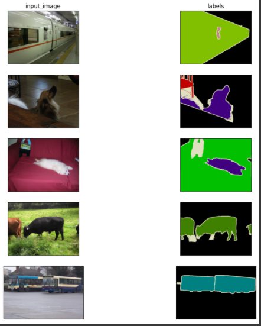

# セマンティックセグメンテーション
概要: ピクセル単位で事前に定義されたアノテーションデータからクラス分類を行うタスク  
目的: `pspnet`モデルを構築する。事前に学習されたモデルの重みと結合して推論する。  
目的外: 使用されるメモリが大きい為、１度だけ学習するのでテスト評価は重要視しないこととする。  

### タスク例  
  

### モデル層の理解  
1. `Feature`層  
  
入力画像に対して決まった回数だけ畳み込みをする  
なお、畳み込みとバッチ標準化、ReLUの１ネットを作成しておくと効率がいい。  
途中で一部畳み込みをスキップする層と、そのまま出力する層が存在することに注意する。  

2. `Pyramid`層  
  
入力画像に対してそれぞれ独立して畳み込みをする。独立された重みは共有しない。  
ここでも畳み込みをスキップする層が存在し、最後にチャネルで結合する。  

3. `Decoder`層  
  
出力クラス数にチャネルを変換し、元の画像サイズに拡張処理する。  
重み異なるが、`Feature`層からも処理されるので注意する。  
